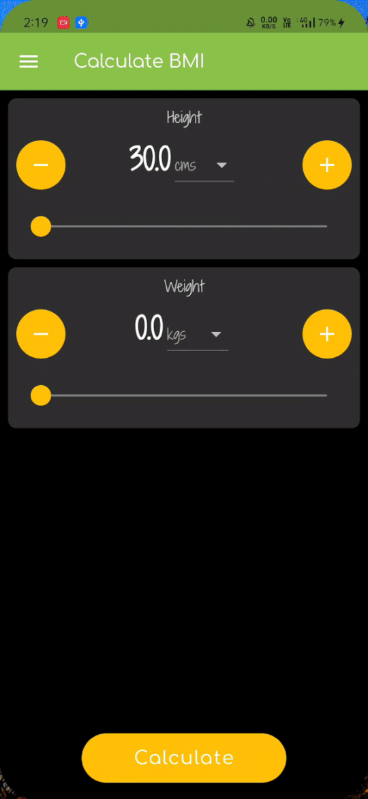

# AppD-Task-BMI-Calculator

## A simple BMI calculator.
Aparoksha Month - AppD Workshop Task
- Name : BMI Calculator
- Difficulty : Medium

There are two separate versions __normal__ (bmi_v1) and __pro__ (bmi_v2).
To try them, you can download the `apk` files for you device from the releases.
There are two releases ->
- one for normal version (v1.0)
- another for pro version (v2.0)

## Screenshots - light and dark theme
 

 

 

### App drawer

### Pro version

## Preview
### Normal version

### Pro version

